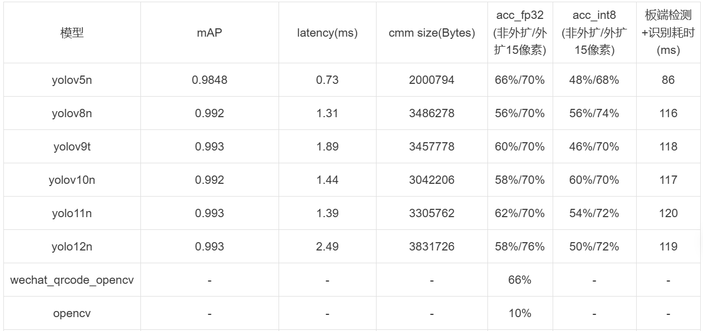
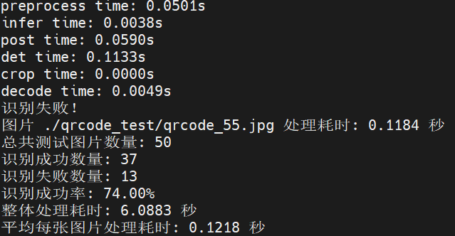

# QRCode_Axera
QRCode det & recognize DEMO on Axera
- 搜集二维码图片数据对ultralytics yolo系列nano/tiny版本进行默认参数训练，量化转换后统计板端模型性能及精度
- 提供yolov5/yolov8系列二维码检测+pyzbar识别板端推理demo
- 目前支持 Python 语言 

## 支持平台

- [x] AX650N

## 模型导出

参考[ultralytics](https://github.com/ultralytics/ultralytics) 中对模型导出方法，为方便部署去掉后处理部分，保留了三个输出分支，执行类似命令导出onnx模型：

```
yolo detect export model=yolov8n.pt format=onnx
```

## 模型转换

- Pulsar2 安装及使用请参考相关文档
  - [在线文档](https://pulsar2-docs.readthedocs.io/zh-cn/latest/index.html)

```
pulsar2 build --config ./qrcode.json
```
得到对应模型用于部署的axmodel。

## 上板部署

- AX650N 的设备已预装 Ubuntu22.04
- 以 root 权限登陆 AX650N 的板卡设备
- 链接互联网，确保 AX650N 的设备能正常执行 `apt install`, `pip install` 等指令
- 已验证设备：AX650N DEMO Board

### Python API 运行

#### Requirements

二维码识别需要安装 pyzbar 库，安装命令如下:
```
sudo apt-get update
sudo apt-get install libzbar-dev
pip install pyzbar
``` 

#### 运行

##### 基于 ONNX Runtime 运行  
可在开发板或PC运行 

在开发板或PC上，运行以下命令  
```  
python3 QRCode_onnx_infer_v5.py
or
python3 QRCode_onnx_infer_v8.py
```

##### 基于AXEngine运行  
在开发板上运行命令

```
python3 QRCode_axmodel_infer_v5.py
or
python3 QRCode_axmodel_infer_v8.py
```  


### 效果统计

#### AX650N

使用./qrcode_test下的图片作为测试集，对ultralytics yolo不同版本模型进行检测+识别测试，效果统计如下：



```
注：
    1.外扩表示模型在检测到二维码后对检测框扩边，从原图截取对应区域后，再送至pyzbar库进行识别;v5/v8检测后处理工程均从ultralytics等原工程中剥离，仅供参考，v8~v12模型均使用v8后处理逻辑；
    2.wechat_qrcode_opencv/opencv为二维码检测识别开源库，统计结果为直接输入原图测试。其余均为模型检测+crop+pyzbar识别结果；
    3.latency为模型推理耗时，整流程耗时大部分在preprocess和postprocess阶段。测试图片均为单二维码图片，耗时仅供参考；
```