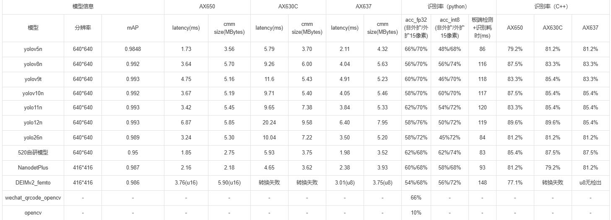

# QRCode_Axera
QRCode det & recognize DEMO on Axera
- 搜集5w张二维码图片数据对轻量级目标检测模型进行默认参数训练，量化转换后统计板端模型性能及精度
- 目前支持ultralytics yolo/DEIMv2/NanodetPlus，提供yolov5/yolov8/DEIMv2/NanodetPlus系列二维码检测+zbar识别板端推理python/C++ demo
- 目前支持 Python/C++ 语言 

## 支持平台

- [x] AX650N
- [x] AX630C
- [x] AX637

## 模型导出

YOLO系列参考[ultralytics](https://github.com/ultralytics/ultralytics) 中对模型导出方法，为方便部署去掉后处理部分，保留了三个输出分支，执行类似命令导出onnx模型：

```
yolo detect export model=yolov8n.pt format=onnx
```

DEIMv2系列参考[DEIMv2](https://github.com/wzf19947/DEIMv2) 中readme.txt模型导出方法，为方便部署去掉后处理部分，执行类似命令导出onnx模型：
```
python tools/deployment/export_onnx_deploy.py --check -c configs/deimv2/deimv2_hgnetv2_femto_coco.yml -r  weights/deimv2_hgnetv2_femto_coco.pth
```

NanoDet系列参考[NanoDet](https://github.com/wzf19947/Nanodet.git)中的模型导出方法
```
python export_onnx.py
```

## 模型转换

- Pulsar2 安装及使用请参考相关文档
  - [在线文档](https://pulsar2-docs.readthedocs.io/zh-cn/latest/index.html)

```
pulsar2 build --config ./yolo.json
or
pulsar2 build --config ./deimv2.json
or
pulsar2 build --config ./nanodet.json
```
得到对应模型用于部署的axmodel。（文件目录移动需要修改对应路径）
注:deimv2模型现阶段部署仅支持AX650上U16量化。

## 上板部署

- 以 root 权限登陆 AX650N/AX630C/AX637 的板卡设备
- 已验证设备：AX650N/AX630C/AX637 DEMO Board

### Python API 运行

#### Requirements

二维码识别需要安装 pyzbar 库，安装命令如下:
```
sudo apt-get update
sudo apt-get install libzbar-dev
pip install pyzbar
``` 

#### 运行

##### 基于 ONNX Runtime 运行  
可在开发板或PC运行 

在开发板或PC上，运行以下命令  
```  
python3 QRCode_onnx_infer_xxx.py
```

##### 基于AXEngine运行  
在开发板上运行命令

```
python3 QRCode_axmodel_infer_xxx.py
```  

### C++ demo编译

#### 基于zbar

二维码识别需要安装 zbar 库，交叉编译方法如下:

1.下载源码：
```
git clone https://github.com/mchehab/zbar.git
```

2.安装依赖库
```
sudo apt-get install autoconf autopoint pkg-config libtool gcc make gettext libpng-dev
```

3.交叉编译库

以AX650为例，其编译器为aarch64-none-linux-gnu，则执行命令：
```
cd zbar-master/
autoreconf -vfi
./configure --host=aarch64-none-linux-gnu -prefix=$PWD/build_ax650
make clean && make & make install
```
AX630C、AX637编译方法同上，更换对应的编译器执行命令即可。

4.拷贝库和头文件到SDK相应目录
```
cd build_ax650/
scp lib/libzbar.a /home/workspace/Feng/ax-samples-main/ax650n_bsp_sdk-main/msp/out/lib/
scp lib/libzbar.so* /home/workspace/Feng/ax-samples-main/ax650n_bsp_sdk-main/msp/out/lib/
scp -r include/* /home/workspace/Feng/ax-samples-main/ax650n_bsp_sdk-main/msp/out/include/
```

5.编译上板demo

开源项目[AX_Samples](https://github.com/AXERA-TECH/ax-samples)实现了常见的深度学习开源算法在 爱芯元智 的 AI SoC 上的示例代码，方便社区开发者进行快速评估和适配。
最新版本已开始提供 AX650 系列（AX650A、AX650N）、AX620E 系列（AX630C、AX620Q）的 NPU 示例。

以AX650为例，编译参考[compile_650.md](https://github.com/AXERA-TECH/ax-samples/blob/main/docs/compile_650.md), 编译.cc文件得到可执行程序。

将zbar加入[ax650.cmake](https://github.com/AXERA-TECH/ax-samples/blob/main/cmake/ax650.cmake)中：
```
target_link_libraries(${example_name} PRIVATE ${CMAKE_THREAD_LIBS_INIT} ax_interpreter ax_sys ax_ivps zbar)
```

AX630C、AX637的板端编译方法同理参考对应的compile_xxx.md、修改对应cmake即可。

#### 基于ZXing

ZXing同样是一个常用二维码识别库，交叉编译方法如下:

1.下载源码：
```
git clone https://github.com/zxing-cpp/zxing-cpp.git --recursive --single-branch --depth 1
git clone https://github.com/nothings/stb.git
```

2.安装依赖库
参考https://blog.csdn.net/YOULANSHENGMENG/article/details/149027531
修改cmake和cmakelist


3.交叉编译库

以AX650为例，其编译器为aarch64-none-linux-gnu，在ZXing工程上一级目录执行命令：
```
cmake -S zxing-cpp -B zxing-cpp.release -DCMAKE_BUILD_TYPE=Release -DCMAKE_C_COMPILER=/path/to/aarch64-linux-gnu-gcc -DCMAKE_CXX_COMPILER=/path/to/aarch64-linux-gnu-g++ -DBUILD_SHARED_LIBS=ON -DCMAKE_CXX_STANDARD=17

cmake --build zxing-cpp.release -j8 --config Release 

```
需显示指定使用c++ 17标准，最终so生成在zxing-cpp.release目录下。AX630C、AX637编译方法同上，更换对应的编译器执行命令即可。

4.拷贝库和头文件到SDK相应目录
```
cd zxing-cpp.release/core/
scp libZXing.so* /home/workspace/Feng/ax-samples-main/ax650n_bsp_sdk-main/msp/out/lib/
cd zxing-cpp/core/src
scp -r *.h /home/workspace/Feng/ax-samples-main/ax650n_bsp_sdk-main/msp/out/include/ZXing
```

5.编译上板demo

开源项目[AX_Samples](https://github.com/AXERA-TECH/ax-samples)实现了常见的深度学习开源算法在 爱芯元智 的 AI SoC 上的示例代码，方便社区开发者进行快速评估和适配。
最新版本已开始提供 AX650 系列（AX650A、AX650N）、AX620E 系列（AX630C、AX620Q）的 NPU 示例。

以AX650为例，编译参考[compile_650.md](https://github.com/AXERA-TECH/ax-samples/blob/main/docs/compile_650.md), 编译.cc文件得到可执行程序。

将ZXing加入[ax650.cmake](https://github.com/AXERA-TECH/ax-samples/blob/main/cmake/ax650.cmake)中：
```
target_link_libraries(${example_name} PRIVATE ${CMAKE_THREAD_LIBS_INIT} ax_interpreter ax_sys ax_ivps ZXing)
```

AX630C、AX637的板端编译方法同理参考对应的compile_xxx.md、修改对应cmake即可。

#### 运行

##### 基于AXEngine运行  
将编好的动态库文件拷贝到开发板：

```
scp libzbar.so* root@10.126.XX.1XX:/opt/lib/
scp libZXing.so* root@10.126.XX.1XX:/opt/lib/
```

将所需可执行文件、模型、图片等拷贝到开发板，并在开发板上运行命令：

```
./ax_yolov5_qrcode_batch -m ./yolov5n_650_npu1.axmodel -i ./qrcode_test/
./ax_yolov8_qrcode_batch -m ./yolov8n_650_npu1.axmodel -i ./qrcode_test/
./ax_yolov8_qrcode_batch_zxing -m ./yolov8n_650_npu1.axmodel -i ./qrcode_test/
./ax_deimv2_qrcode_batch -m ./deimv2_femto_650_npu1_u16.axmodel -i ./qrcode_test/
./ax_nanodetplus_qrcode_batch -m nanodet-plus-m_650_npu1.axmodel - i qrcode_test/
```  

### 板端结果
```
使用./qrcode_test下的图片作为测试集，进行检测+识别测试，效果如下：
--------------------------------------
image path: qrcode_test//qrcode_55.jpg image index: qrcode_55
post process cost time:0.93 ms
--------------------------------------
Repeat 1 times, avg time 3.73 ms, max_time 3.73 ms, min_time 3.73 ms
--------------------------------------
detection num: 1
 0:  96%, [1021,  749, 1145,  869], QRCode
ZBAR cut region = [123 x 119]
ZBAR scan n = 0
ZBAR scan success use expand size of 153x150
Decode data:[C:CNS:Aixin-GuestP:aixinguestK:e1QbyyUv], type:[QR-Code]
--------------------------------------
Total pics:48
Total decode count:42
Decode rate:87.5%

```

### 效果统计

使用./qrcode_test下的图片作为测试集，进行检测+识别测试，zbar效果统计如下：

```
注：
1.YOLOv10~v12在使用默认参数训练时均有不同程度loss inf异常但最终mAP正常，可能与未使用预训练模型有关；
2.检测框比较贴近二维码的识别率反而不高，检测区域适当外扩后识别效果更好；
3.python demo识别率仅简单对比了是否外扩对精度的影响；C++ demo识别率则是额外加入了图像处理操作后的最终效果；模型latency和cmm size均通过ax_run_model统计，模型均为NPU1 mode；
4.对图片直接使用开源二维码识别库opencv/wechat_qrcode_opencv进行识别，识别率低于检测+crop+zbar识别方案。
5.测试数据均为单二维码图片，测试耗时仅供参考。
6.yolov8检出输出相同QR图片、相同预处理情况下，zbar效果明显优于ZXing，可能不同算法侧重不同，仅供参考。
```